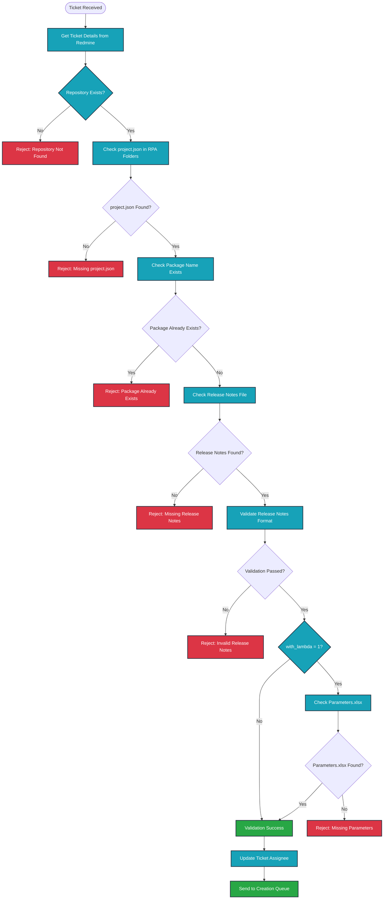
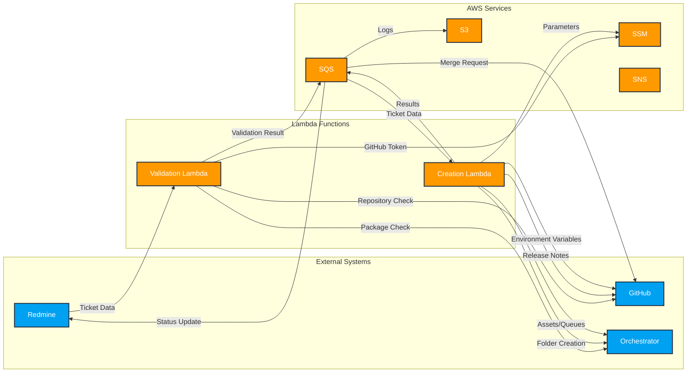

# RCA Lambda Functions Flow Diagram

## Complete System Flow

```mermaid
graph TD
    %% External Systems
    Redmine[Redmine Ticket System]
    GitHub[GitHub Repository]
    Orchestrator[RPA Orchestrator]
    
    %% AWS Services
    SQS[SQS Queue]
    SSM[SSM Parameter Store]
    S3[S3 Storage]
    SNS[SNS Notifications]
    
    %% Lambda Functions
    ValidationLambda[RCA Validation Lambda]
    CreationLambda[RCA Creation Lambda]
    
    %% Start
    Start([Ticket Created in Redmine])
    
    %% Validation Flow
    Start --> ValidationLambda
    ValidationLambda --> |1. Get Ticket Details| Redmine
    ValidationLambda --> |2. Get GitHub Token| SSM
    ValidationLambda --> |3. Check Repository Exists| GitHub
    
    %% Validation Checks
    ValidationLambda --> |4. Validate project.json| GitHub
    ValidationLambda --> |5. Check Package Exists| Orchestrator
    ValidationLambda --> |6. Download Release Notes| GitHub
    ValidationLambda --> |7. Validate Release Notes| ValidationLambda
    
    %% Validation Decision
    ValidationLambda --> |Validation Failed| SQS
    ValidationLambda --> |Validation Success| SQS
    SQS --> |Send to Creation Queue| CreationLambda
    
    %% Creation Flow
    CreationLambda --> |1. Get Ticket Data| SQS
    CreationLambda --> |2. Get Parameters| SSM
    CreationLambda --> |3. Download Release Notes| GitHub
    
    %% Folder Creation
    CreationLambda --> |4. Create Parent Folder| Orchestrator
    CreationLambda --> |5. Create Worker Folder| Orchestrator
    CreationLambda --> |6. Create Loader Folder| Orchestrator
    CreationLambda --> |7. Create Handoff Folder| Orchestrator
    
    %% Infrastructure Creation
    CreationLambda --> |8. Create Assets| Orchestrator
    CreationLambda --> |9. Create Queues| Orchestrator
    
    %% Environment Setup
    CreationLambda --> |10. Set Environment Variables| GitHub
    
    %% Success/Error Handling
    CreationLambda --> |Success| SQS
    CreationLambda --> |Errors Found| SQS
    CreationLambda --> |Warnings Found| SQS
    
    %% Final Steps
    SQS --> |Update Ticket Status| Redmine
    SQS --> |Send to Merge Request| GitHub
    SQS --> |Log to Kibana| S3
    
    %% Styling
    classDef lambda fill:#ff9900,stroke:#232f3e,stroke-width:2px,color:#fff
    classDef aws fill:#ff9900,stroke:#232f3e,stroke-width:2px,color:#fff
    classDef external fill:#00a1f1,stroke:#232f3e,stroke-width:2px,color:#fff
    classDef decision fill:#f90,stroke:#232f3e,stroke-width:2px,color:#fff
    
    class ValidationLambda,CreationLambda lambda
    class SQS,SSM,S3,SNS aws
    class Redmine,GitHub,Orchestrator external
    class Start decision
```

## Detailed Validation Flow

```mermaid
flowchart TD
    Start([Ticket Received]) --> GetTicket[Get Ticket Details from Redmine]
    GetTicket --> CheckRepo{Repository Exists?}
    
    CheckRepo -->|No| RejectRepo[Reject: Repository Not Found]
    CheckRepo -->|Yes| CheckProject[Check project.json in RPA Folders]
    
    CheckProject --> ProjectExists{project.json Found?}
    ProjectExists -->|No| RejectProject[Reject: Missing project.json]
    ProjectExists -->|Yes| CheckPackage[Check Package Name Exists]
    
    CheckPackage --> PackageExists{Package Already Exists?}
    PackageExists -->|Yes| RejectPackage[Reject: Package Already Exists]
    PackageExists -->|No| CheckReleaseNotes[Check Release Notes File]
    
    CheckReleaseNotes --> ReleaseNotesExist{Release Notes Found?}
    ReleaseNotesExist -->|No| RejectReleaseNotes[Reject: Missing Release Notes]
    ReleaseNotesExist -->|Yes| ValidateReleaseNotes[Validate Release Notes Format]
    
    ValidateReleaseNotes --> ValidationResult{Validation Passed?}
    ValidationResult -->|No| RejectValidation[Reject: Invalid Release Notes]
    ValidationResult -->|Yes| CheckLambda{with_lambda = 1?}
    
    CheckLambda -->|Yes| CheckParameters[Check Parameters.xlsx]
    CheckLambda -->|No| SuccessValidation[Validation Success]
    
    CheckParameters --> ParametersExist{Parameters.xlsx Found?}
    ParametersExist -->|No| RejectParameters[Reject: Missing Parameters]
    ParametersExist -->|Yes| SuccessValidation
    
    SuccessValidation --> UpdateAssignee[Update Ticket Assignee]
    UpdateAssignee --> SendToCreation[Send to Creation Queue]
    
    %% Styling
    classDef success fill:#28a745,stroke:#232f3e,stroke-width:2px,color:#fff
    classDef error fill:#dc3545,stroke:#232f3e,stroke-width:2px,color:#fff
    classDef process fill:#17a2b8,stroke:#232f3e,stroke-width:2px,color:#fff
    
    class SuccessValidation,SendToCreation success
    class RejectRepo,RejectProject,RejectPackage,RejectReleaseNotes,RejectValidation,RejectParameters error
    class GetTicket,CheckRepo,CheckProject,CheckPackage,CheckReleaseNotes,ValidateReleaseNotes,CheckLambda,CheckParameters,UpdateAssignee process
```

## Detailed Creation Flow

```mermaid
flowchart TD
    Start([Message from SQS]) --> ParseMessage[Parse SQS Message]
    ParseMessage --> ExtractFields[Extract Custom Fields]
    ExtractFields --> DownloadReleaseNotes[Download Release Notes from GitHub]
    DownloadReleaseNotes --> ReadExcel[Read Excel File]
    ReadExcel --> GetBasePath[Get Base Folder Path]
    GetBasePath --> CreateParentFolder[Create Parent Folder]
    
    CreateParentFolder --> CheckCounts{Check Loader/Worker/Handoff Counts}
    CheckCounts --> CreateWorkerFolder{Worker Count > 0?}
    CreateWorkerFolder -->|Yes| CreateWorker[Create Worker Folder]
    CreateWorkerFolder -->|No| CreateLoaderFolder{Loader Count > 0?}
    
    CreateLoaderFolder -->|Yes| CreateLoader[Create Loader Folder]
    CreateLoaderFolder -->|No| CreateHandoffFolder{Handoff Count > 0?}
    
    CreateHandoffFolder -->|Yes| CreateHandoff[Create Handoff Folder]
    CreateHandoffFolder -->|No| CreateAssets[Create Assets from Excel]
    
    CreateWorker --> CreateLoaderFolder
    CreateLoader --> CreateHandoffFolder
    CreateHandoff --> CreateAssets
    
    CreateAssets --> CreateQueues[Create Queues from Excel]
    CreateQueues --> CheckErrors{Any Errors?}
    
    CheckErrors -->|Yes| SendError[Send Error to SQS]
    CheckErrors -->|No| CheckWarnings{Any Warnings?}
    
    CheckWarnings -->|Yes| SendWarning[Send Warning to SQS]
    CheckWarnings -->|No| SendSuccess[Send Success to SQS]
    
    SendError --> UpdateTicketError[Update Ticket Status: Rejected]
    SendWarning --> UpdateTicketWarning[Update Ticket Status: In Progress]
    SendSuccess --> UpdateTicketSuccess[Update Ticket Status: In Progress]
    
    UpdateTicketError --> End([End])
    UpdateTicketWarning --> SendToMerge[Send to Merge Request]
    UpdateTicketSuccess --> SendToMerge
    
    SendToMerge --> LogToKibana[Log to Kibana]
    LogToKibana --> End
    
    %% Styling
    classDef success fill:#28a745,stroke:#232f3e,stroke-width:2px,color:#fff
    classDef error fill:#dc3545,stroke:#232f3e,stroke-width:2px,color:#fff
    classDef process fill:#17a2b8,stroke:#232f3e,stroke-width:2px,color:#fff
    classDef warning fill:#ffc107,stroke:#232f3e,stroke-width:2px,color:#000
    
    class SendSuccess,UpdateTicketSuccess,LogToKibana success
    class SendError,UpdateTicketError error
    class ParseMessage,ExtractFields,DownloadReleaseNotes,ReadExcel,GetBasePath,CreateParentFolder,CreateAssets,CreateQueues process
    class SendWarning,UpdateTicketWarning warning
```

## Data Flow Between Services

```mermaid
graph LR
    subgraph "External Systems"
        Redmine[Redmine]
        GitHub[GitHub]
        Orchestrator[Orchestrator]
    end
    
    subgraph "AWS Services"
        SQS[SQS]
        SSM[SSM]
        S3[S3]
        SNS[SNS]
    end
    
    subgraph "Lambda Functions"
        Validation[Validation Lambda]
        Creation[Creation Lambda]
    end
    
    %% Data Flow
    Redmine -->|Ticket Data| Validation
    Validation -->|GitHub Token| SSM
    Validation -->|Repository Check| GitHub
    Validation -->|Package Check| Orchestrator
    Validation -->|Validation Result| SQS
    
    SQS -->|Ticket Data| Creation
    Creation -->|Parameters| SSM
    Creation -->|Release Notes| GitHub
    Creation -->|Folder Creation| Orchestrator
    Creation -->|Assets/Queues| Orchestrator
    Creation -->|Environment Variables| GitHub
    Creation -->|Results| SQS
    
    SQS -->|Status Update| Redmine
    SQS -->|Merge Request| GitHub
    SQS -->|Logs| S3
    
    %% Styling
    classDef lambda fill:#ff9900,stroke:#232f3e,stroke-width:2px,color:#fff
    classDef aws fill:#ff9900,stroke:#232f3e,stroke-width:2px,color:#fff
    classDef external fill:#00a1f1,stroke:#232f3e,stroke-width:2px,color:#fff
    
    class Validation,Creation lambda
    class SQS,SSM,S3,SNS aws
    class Redmine,GitHub,Orchestrator external
``` 